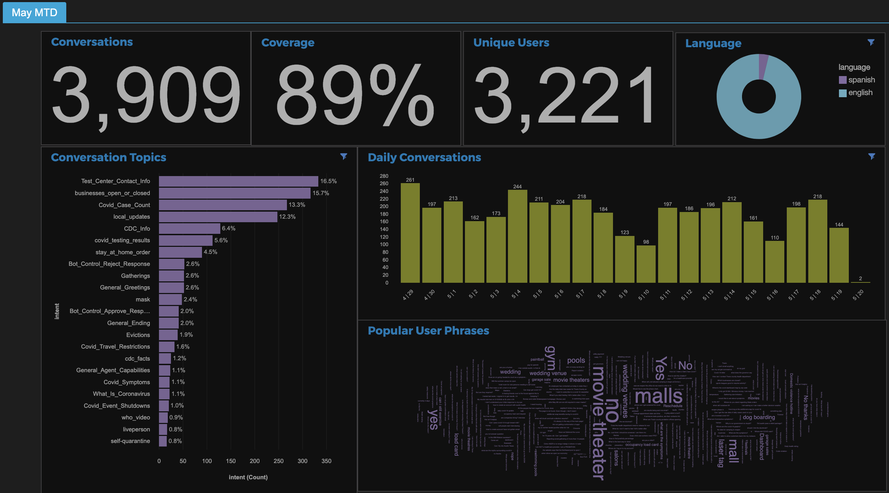
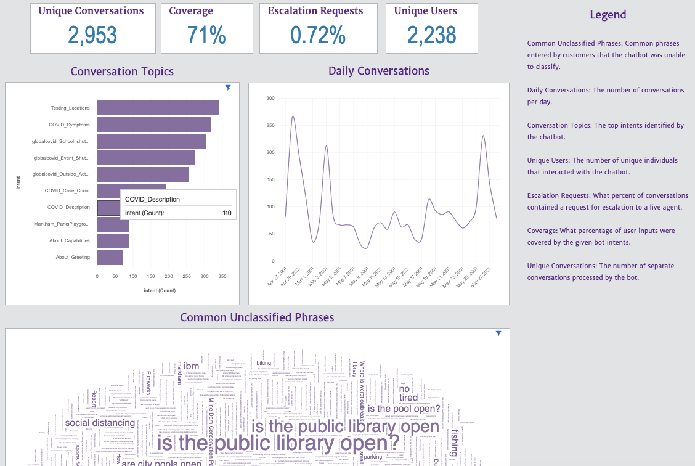

# Summary
This Jupyter notebook was developed for analyzing the conversation logs for Watson Assistant (and Voice Interaction) solutions. It will retrieve the data from the the logs API, transform the data, and extract key metrics for use in Watson Studio's Cognos Dashboard. Further data exploration and analysis can be performed, and ad-hoc reports can be built.

KPIs include coverage, containment, escalation, and other key metrics vital to reporting on the performance of a Watson Assistant solution.

## Prerequisites
1. Watson Assistant credentials
2. Watson Studio instance

## Instructions
1. Log into Watson Studio (https://dataplatform.cloud.ibm.com/) and create a new project, e.g. `[Customer_Name] Watson Project`.
2. Click `Add to project +`
3. Click `Notebook`
4. Click `From URL`
5. Under `Notebook URL`, enter in `https://github.com/preethm/watson-assistant-metrics-notebook/blob/master/Watson%20Assistant%20Metrics%20Notebook.ipynb`
6. Enter a name for the notebook, e.g. `Watson Assistant Metrics Notebook [Client_Name]`
7. Add optional description, e.g. `This notebook will extract logs and identify metrics for use in a Cognos dashboard.`
8. Select runtime (default Python 3.6 XS is OK)
9. Click `create`
10. The first cell (in the Housekeeping section) requires project id and token in order to save the CSV files to data assets. Follow these instructions: https://dataplatform.cloud.ibm.com/docs/content/wsj/analyze-data/token.html
11. Follow the remaining instructions of the notebook. Keep an eye out for `Action required` notes in Section 2. Section 3 allows you to perform blind testing and is optional.
12. Upon completion of notebook, CSV files will be saved to your project's data assets. It is highly recommended to build a Cognos dashboard in Watson Studio in order to share metrics and insights with your account/client stakeholders. To build visualizations, a tutorial can be found: https://developer.ibm.com/tutorials/create-interactive-dashboards-on-watson-studio/

## Example dashboards

Happy Analyzing!
